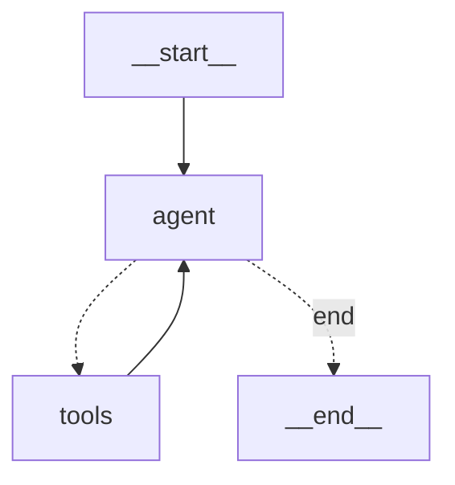

# Daily Digest

Personal intelligence agent that expands curated sources into synthesized insights.

Status: Minimal first pass for eval-driven iteration. Core flow functional.

## Flow

```
inbox.jsonl → expand (agent) → digest → archive by topic
```

### Agent Graph



The agent loops between calling Claude (with tools bound) and executing tool calls until it produces structured JSON output or hits the 10-turn limit.

## Usage

```bash
# Add source to inbox
uv run python -m src.daily_digest.cli add "https://example.com/article" --note "why interesting"

# Expand all inbox items
uv run python -m src.daily_digest.cli run

# Generate digest from expansions
uv run python -m src.daily_digest.cli digest

# View topics in archive
uv run python -m src.daily_digest.cli topics

# Collect seed URLs for eval dataset
uv run daily-digest seeds collect --categories="agent-evaluation" --target=5 --score --review --output=seeds.jsonl

# List available topic categories
uv run daily-digest seeds categories

# Validate a URL
uv run daily-digest seeds validate --url="https://example.com/article"
```

### Seed Collection

The `seeds` command builds eval datasets by collecting high-quality URLs across topic categories.

```bash
# Full workflow: collect → score → review → export
daily-digest seeds collect \
  --categories="agent-evaluation,procedural-memory" \
  --target=5 \
  --score \
  --review \
  --output=approved_seeds.jsonl
```

Options:
- `--categories`: Comma-separated topic categories (default: all)
- `--target`: Seeds per category (default: 8)
- `--score`: AI quality scoring (1-5)
- `--review`: Interactive approve/reject after collection
- `--output`: Export path for JSONL

Review a previously collected file:
```bash
daily-digest seeds review --file=raw.jsonl --output=approved.jsonl
```

## Structure

```
digests/
  SOURCES.md      # Curated sources tracker (human-readable)
  2026-01-11.md   # Daily digest output
archive/          # Expansions filed by topic
trajectories/     # Agent run logs for analysis
WORLD_VIEW.md     # Cross-session synthesis
```

## Stack

- LangGraph agent with Claude Sonnet 4
- Tavily web search
- GitHub API for repo info
- SSRF protection on URL fetching

## Config

```bash
export ANTHROPIC_API_KEY=...
export TAVILY_API_KEY=...
export GITHUB_TOKEN=...  # optional

# LangSmith tracing (optional)
export LANGSMITH_API_KEY=...
export LANGSMITH_TRACING=true  # disabled by default
export LANGSMITH_PROJECT=daily-digest
```
